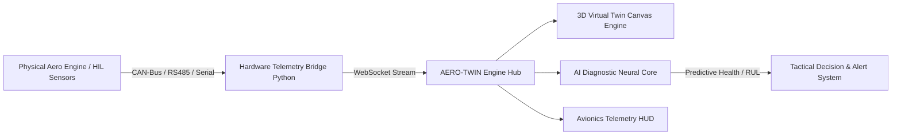

# AERO-TWIN: DRDO MALE UAV Aero Piston Engine Digital Twin
### Smart India Hackathon (SIH 2026) | Problem Statement: 26054

[](https://github.com)
[](https://sih.gov.in)
[](https://github.com)
[](LICENSE)

---

## 🎯 Executive Overview
**AERO-TWIN** is a cutting-edge, real-time **AI-Enabled Digital Twin Ground Control Station (GCS)** engineered for the health monitoring, fault prediction, and mission reliability enhancement of **Aero Piston Engines** powering **Medium Altitude Long Endurance (MALE) UAVs**.

Designed directly to address **DRDO SIH 2026 Problem Statement 26054**, this system establishes a bidirectional synchronized twin between physical aero-engine avionics/sensors and a high-fidelity virtual twin with physics-informed predictive diagnostics.

---

## 🚀 Key Features

### 1. 🌐 Interactive 3D Digital Twin Engine Engine
* Real-time 60 FPS Canvas 3D engine model with component-level isolation.
* Inspectable assemblies: **Crankshaft, Piston Assembly, Turbocharger, Fuel Injectors, Cylinder Heads, and Valve Trains**.
* Dynamic thermal & mechanical stress heatmap visualization based on live telemetry.
* Component dissection, X-Ray wireframe mode, and exploded view for MRO (Maintenance, Repair, and Overhaul) workflows.

### 2. 📊 Real-Time Avionics Telemetry HUD
* High-frequency telemetry pipeline: **RPM, CHT (Cylinder Head Temp), EGT (Exhaust Gas Temp), MAP (Manifold Absolute Pressure), Oil Pressure & Temp, Fuel Flow, Vibration Spectra, and Altitude Barometrics**.
* Audio avionics warning system with acoustic fault alarms.
* CAN-Bus frame decoder & raw hex stream telemetry inspector.

### 3. 🧠 AI Predictive Diagnostics & Health Index (PHM)
* **Remaining Useful Life (RUL)** estimator based on run-hour stress cycles.
* Real-time anomaly detection identifying incipient micro-failures prior to catastrophic degradation.
* Diagnostic matrix covering:
  * Piston ring wear & blow-by
  * Turbocharger bearing play & boost drop
  * Fuel injector clogging / detonation
  * Lubrication starvation & thermal runaway

### 4. ⚡ Tactical Fault Simulator & Stress Test Bench
* Inject simulated operational emergencies:
  * High-Altitude Low-O2 Hypoxia
  * Oil Line Micro-Rupture
  * CHT Overheating Spike
  * Sensor Telemetry Dropout
* Instantaneous AI recovery trajectory recommendations.

### 5. 🗺️ Mission Route Planner & Reliability Assessor
* Real-time mission corridor simulation with waypoint risk assessment.
* Engine power reserve vs. climb rate and weather headwinds calculations.
* Automated emergency divert airbase calculation if engine RUL drops below mission margin.

### 6. 🔌 Hardware-In-The-Loop (HIL) Ready
* Arduino / ESP32 sensor firmware included (`hardware/arduino_aero_engine_sensors.ino`).
* Python Serial/CAN-Bus bridge (`hardware/hardware_bridge.py`) for live telemetry ingestion.

---

## 🏗️ System Architecture



---

## 🌐 Deploy to GitHub Pages in 30 Seconds

1. Create a **New Repository** on GitHub (e.g., `aerotwin-uav`).
2. Upload the contents of this repository to the `main` branch.
3. In GitHub, navigate to:
   * **Settings** ⚙️ ➔ **Pages** (in the left sidebar).
   * Under **Build and deployment**:
     * **Source**: `Deploy from a branch`
     * **Branch**: `main` | `/ (root)`
     * Click **Save**.
4. Within 30 seconds, your site will be permanently live at:
   ```
   https://<your-username>.github.io/aerotwin-uav/
   ```

---

## 💻 Running Locally

### Option A: Direct Browser (No Server Needed)
Simply double-click `index.html` in your file explorer. All 3D models, audio synthesizers, and diagnostic networks will run entirely client-side!

### Option B: Local Development Server
```bash
# Clone the repository
git clone https://github.com/<your-username>/aerotwin-uav.git
cd aerotwin-uav

# Run with any static server (e.g. Node, Python, VS Code Live Server)
npx serve .
# OR
python -m http.server 3000
```

---

## 📂 Repository Structure

```
├── index.html                   # Complete Standalone App (Ready for GitHub Pages)
├── index_modular.html           # Modular source referencing external CSS/JS
├── README.md                    # Project documentation & SIH specifications
├── LICENSE                      # MIT Open-Source License
├── .nojekyll                    # GitHub Pages asset routing configuration
├── .gitignore                   # Version control ignore rules
├── css/                         # Modular CSS Design System
│   ├── main.css                 # Ground Control Station styling
│   ├── digital-twin.css         # 3D Canvas & avionics panels
│   └── mission.css              # Mission corridor HUD styles
├── js/                          # Modular Architecture Scripts
│   ├── engine-3d.js             # Canvas 3D Engine Model Renderer
│   ├── component-3d.js          # Component-level 3D meshes & stress maps
│   ├── telemetry-engine.js      # Avionics telemetry generator & parser
│   ├── hardware-link.js         # Serial & WebSocket HIL connection
│   ├── ai-diagnostic-net.js     # Predictive neural network & RUL model
│   ├── fault-simulator.js       # Fault injection scenarios
│   ├── mission-planner.js       # Mission corridor route evaluator
│   ├── report-generator.js      # PDF & CSV mission health export
│   └── app.js                   # Main application coordinator
├── hardware/                    # Hardware-In-The-Loop (HIL) Integration
│   ├── arduino_aero_engine_sensors.ino # Microcontroller sensor sketch
│   └── hardware_bridge.py       # Serial-to-WebSocket bridge
└── server/                      # Local telemetry relay server
    └── server.js
```

---

## 👥 DRDO SIH 2026 Team
* **Project**: AERO-TWIN (Problem Statement 26054)
* **Domain**: Aerospace / Defense / AI Digital Twin
* **Developed for**: DRDO MALE UAV Aero Piston Engine Health Monitoring
